## 👋🏻 I can automate/bot literally anything 
**As a programmer, it is your job to put yourself out of business. What you do today can be automated tomorrow 🤖 (Doug McIlroy)**

**Never spend 6 minutes doing something by hand when you can spend 6 hours failing to automate it 👷 (Zhuowei Zhang)**

**Automated testing is a safety net that protects the program from its programmers 🐛 (Yegor Bugayenko)**

<a href="https://github.com/connor9994/GitHub-Language-Stats">


</a>

## 🚀 About Me
I am a versatile Frontend Developer with a passion for problem-solving and innovation. With a background in Biomedical Engineering and hands-on experience in developing automation tools, I bring a unique perspective to software development and technical support.

## 💻 Skills & Expertise
### Coding Languages:
C/C++/C# | Python | JavaScript | Lua | PowerShell | HTML | CSS | AutoHotKey | WebAssembly | Shell | MATLAB | LabView

### Tools & Technologies:
- **Development:** AutoCAD  / Solidworks  / Adobe Creative Suite 
- **Data Analysis:** Power BI  / Tableau 

- **Operating Systems:** Linux (Kali + Fedora) / Office 365 Administration
- **Hardware:** PLCs (Rockwell, Siemens) / Biosignal Analysis (X-Ray/CT, MRI, Ultrasound, PET/SPECT)

## 💼 Work Experience
### TANYR Healthcare:
- **Frontend Developer:** Utilized various technologies for efficient data handling and report generation.
- **Information Technology Specialist:** Developed software for workflow automation and ensured data security compliance.

### OSIsoft:
- **Product Support Engineer:** Provided technical support, developed automated utilities, and conducted field-service trips for troubleshooting.

## 🌟 Fun Projects:
<table style="width: 100%;">
  <tr>
    <td>Spotify Auto-Viewer<br>Spotify Account-Creator</td>
    <td></td>
  </tr>
  <tr>
    <td>WoW fishing bot<br>(Normal/Classic)</td>
    <td></td>
  </tr>
  <tr>
    <td>Bitcoin trading bot<br></td>
    <td></td>
  </tr>
  <tr>
    <td>Various healthcare applications<br>(compliant with HIPAA regulations)</td>
    <td></td>
  </tr>
  <tr>
    <td>Salesforce add-ons <br></td>
    <td></td>
  </tr>
  <tr>
    <td>Social media bots<br></td>
    <td></td>
  </tr>
  <tr>
    <td>SPY trading-strategy generators<br></td>
    <td></td>
  </tr>
</table>

## 📫 Let's Connect!
Feel free to reach out for collaboration opportunities, technical discussion, or just to say hi! 

### Want to Send Me An Email?
```html
<input id=username type="text" placeholder="github username or repo link" value="Connor9994">
<button onclick="fetch(`https://api.github.com/users/${username.value.replace(/^.*com[/]([^/]*).*$/,'$1')}/events/public`).then(e=> e.json()).then(e => [...new Set([].concat.apply([],e.filter(x => x.type==='PushEvent').map(x => x.payload.commits.map(c => c.author.email)))).values()]).then(x => results.innerText = x)">GO</button>
<div id=results></div>
```

```mermaid
flowchart LR
    direction LR
    subgraph 1[" "]
        direction TB
        top1[Find Connor's Profile] --> bottom1[Hire Connor 🤝]
    end
    subgraph 2[" "]
        direction TB
        top2[Google Endlessly 🔎] --> bottom2[Waste Time ⌛]
    end

    %% Link to subgraph1
    3[Discover Problem 🐛] --> 1

    %% Link within subgraph2
    3[Discover Problem 🐛] --> 2

    1 --> outside1["Profit" 📈]
    2 --> outside2["Cry" 😢]

    click top1 "https://www.linkedin.com/in/connor-kaiser-6a335a316/" "LinkedIn"

    style 1 stroke:#072ff7,stroke-width:5px
    style 2 stroke:#f70707,stroke-width:5px
```


